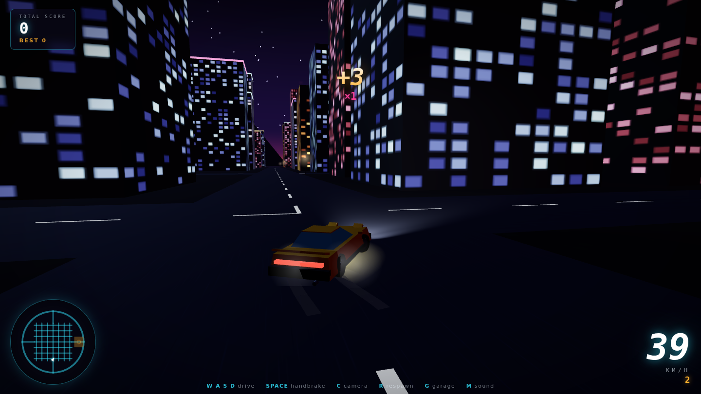
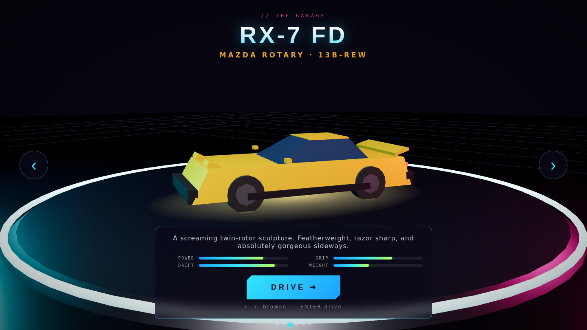

# SCUDDERFING DRIFT 🏎️💨

**An open-world night-drift playground in your browser.** Free-roam a neon city, chain drifts for score, and pick your weapon from a garage of JDM icons and German muscle.



## Play it

It's a fully static web app — no build step, no dependencies to install (Three.js is vendored in `lib/`). Just serve the folder:

```bash
# any static server works:
npx serve .
# or
python3 -m http.server 8000
```

…then open `http://localhost:8000`. (Opening `index.html` directly via `file://` won't work because the game uses ES modules.)

## The garage



| Car | Inspiration | Character |
|---|---|---|
| **AE86 PANDA** | Toyota Corolla hachiroku | Featherweight, drifts on a whisper |
| **SILVIA S15** | Nissan Silvia spec-R | The drift king — balanced and endlessly sideways |
| **RX-7 FD** | Mazda RX-7 | Sharp, light, rotary scream |
| **SUPRA A80** | Toyota Supra | 2JZ freight train — monster power |
| **M3 E46** | BMW M3 | Grip monster, surgical through the grid |
| **190E EVO II** | Mercedes-Benz 190E | DTM battleship — heavy, stable, brutal |

Each car has its own power, grip, drift balance and weight tuning.

## The city

**Neo-Kaido City** — a downtown neon grid to thread, a highway ring to hold long slides on, connector straights, and a dockside drift lot with a marked skid circle and container stacks to swing around. Mountains, harbor cranes, street lamps, blinking tower beacons, stars and a low moon round out the night.

## Controls

| Input | Action |
|---|---|
| `W A S D` / arrows | Throttle · brake/reverse · steer |
| `SPACE` / `Shift` | Handbrake — flick it mid-corner to start a drift |
| `C` | Cycle camera (chase / far / hood) |
| `R` | Respawn |
| `G` / `Esc` | Back to garage |
| `M` | Mute engine + tire audio |

Touch controls appear automatically on mobile.

## Scoring

Get sideways above ~25 km/h to start a **drift chain**. Points scale with speed × angle. Keep it linked to grow the **multiplier** (up to ×10); straighten up for a moment and the chain **banks** into your total. Hit a wall hard and the chain is **wasted**. Best score is saved locally.

Grades: `NICE → GREAT → SICK → INSANE → GODLIKE`

## Tech

- [Three.js](https://threejs.org/) (vendored, r185) — no other dependencies, no build step
- Procedural everything: cars, city, window textures, skid marks, tire smoke
- Custom arcade drift model (velocity-decomposition traction with per-car grip states)
- Synthesized engine, tire screech and wind via the Web Audio API — no audio files
- Single merged geometry for lane markings and skid marks to keep draw calls low
